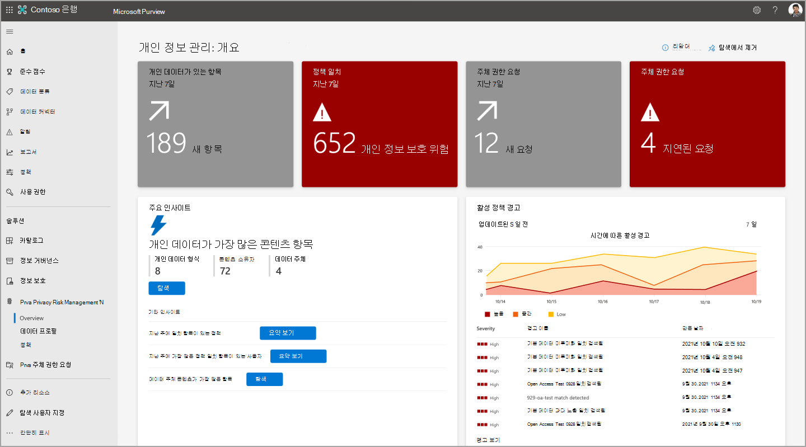

# Microsoft Priva에서 개인 데이터 찾기 및 시각화

Microsoft Priva는 개인 데이터 자산의 검색을 자동화하고 필수 정보의 시각화를 제공하여 조직이 저장하는 데이터를 이해하는 데 도움이 됩니다. 이러한 시각화는 개요 및 데이터 프로필 페이지에서  **찾을 수** 있습니다. 여기서 인사이트에 따라 조직의 개인 정보 보호 정책을 강화하고 위험을 줄일 수 있습니다.

시작을 위해 다음 페이지의 Priva 섹션으로 Microsoft 365 규정 준수 센터 다음  페이지를 하세요.

- **개요**: 조직의 데이터에 대한 전체적인 보기를 Microsoft 365. 개인 정보 관리자는 추세 및 활동을 모니터링하고, 개인 데이터와 관련된 잠재적인 위험을 식별 및 조사하고, 정책 관리 또는 주체 권한 요청 작업과 같은 주요 활동을 진행할 수 있습니다.
- **데이터 프로필**: 조직에서 저장하는 개인 데이터의 스냅숏을 Microsoft 365. 이 페이지에서는 개인 데이터가 있는 위치, 조직에서 가장 많이 사용되는 유형 및 사용자 환경의 여러 위치에 있는 여러 유형의 수를 시각화할 Microsoft 365 있습니다. 이 위치에서 개인 데이터를 탐색할 수도 있습니다.

데이터가 변경되어 Priva가 새로 발견하면 이러한 페이지에 표시되는 정보가 업데이트됩니다. 차트에 새 데이터가 나타내는 데 최대 24시간이 걸릴 수 있습니다.

## 개요 페이지 살펴보기

개요 페이지는 세 가지 기본 섹션으로 구성됩니다. 페이지 맨 위에 있는 타일은 데이터에 대한 필수 최근 통계를 제공합니다. 주요 인사이트 섹션에서는 추세 및 주요 관심 영역에 대한 조사 기회를 제공합니다. 데이터 환경에 대한 자세한 내용은 추세선 그래프를 상의하십시오. 이러한 영역에 대한 자세한 내용은 아래 섹션을 참조하세요.

### 위쪽 타일

#### 지난 7일 동안의 정책 일치

Priva 개인 정보 보호 위험 관리 내에서 정책을 설정하면 개인 정보 보호 위험을 내포할 수 있는 특정 조건에 대한 정책에 따라 데이터가 평가됩니다. 정책 일치는 추가 검토 또는 수정이 필요할 수 있는 데이터 검색을 나타냅니다. 이 타일은 지난 7일 이내에 발생한 정책 일치 수를 보여 주며, 일치하는 내용은 정책이 설정되거나 테스트 모드에서 실행 중인지 여부에 따라 표시될 것이기 때문에 모든 활성 정책의 결과를 볼 수 있습니다. 이 타일을 선택하면 개인 정보 위험 관리의 정책 페이지의 필터링된 보기  로 이동하여 지난 7일 이내에 일치하는 정책을 보여 주게 됩니다.

#### 개인 데이터가 있는 항목

Priva의 자동화된 검색 기능을 확인한 후 개인 데이터 타일이 있는 **항목을 검토** 합니다. 이 타일은 설정에 따라 개인 데이터를 포함하는 새 항목이 지난 7일 동안 조직의 Microsoft 365 환경에서 검색된 새 항목 수를 보여 줍니다. 이 타일을 선택하면 검색된 최신 100개 항목의 보기가 로드됩니다.

#### 주체 권한 요청

개요 페이지에는 지난 7일 동안 만들어진 주체 권한 요청 수를 보여 줄 수 있는 타일이 포함되어 있습니다. 해당하는 경우 두 번째 타일은 지정된 기한에 따라 기한이 지난 요청 수를 보여 주며 즉각적인 주의가 필요할 수 있습니다. 이러한 타일을 선택하면 Priva의 주체 권한 요청 페이지에 대한 적절한 사용 권한이 있는 사용자가 됩니다.

### 주요 인사이트

#### 개인 데이터가 가장 많은 콘텐츠 항목

많은 양의 개인 데이터가 포함된 콘텐츠는 노출 위험이 더 높을 수 있습니다. 이러한 항목을 검토하여 개인 정보 보호 위험 관리 정책이 적용되도록 할 수 있습니다. 이러한 항목을 주의 끌 수 있도록 개요 페이지에서는 설정에 따라 개인 데이터가 가장 많은 콘텐츠 항목에 대한 보기를 제공합니다. 여기서 검색된 고유한 개인 데이터 형식의 수, 식별된 고유 콘텐츠 소유자 수 및 주체 권한 요청에 대한 데이터 일치 설정에 따라 식별된 데이터 주체 수를 볼 수 있습니다.

**찾은 항목의** 요약 보기에 대한 요약 보기를 선택합니다. 이러한 결과를 탐색하여 개별  파일을 미리 볼 수도 있습니다. 이 보기에는 최대 100개 항목이 표시됩니다. 개인 정보 관리 역할 그룹의 사용자는 파일을 선택하여 세부 정보를 검토하고 관련성 확인을 한 다음 참조를 위해 .csv 형식으로 목록을 내보낼 수 있습니다.

#### 지난 주에 일치하는 수가 가장 많은 정책

이 인사이트는 "설정" 모드 또는 "테스트"에서 지난 7일 동안 가장 자주 일치하는 정책을 소개합니다. 이는 Priva 사용자가 개인 정보 보호 동작을 구체화할 때 정책의 성능과 지속적인 작업의 영향을 설명하는 데 도움이 됩니다.

일치하는 **상위** 10개 정책 및 연결된 콘텐츠의 콘텐츠 소유자에 대한 요약을 요약 보기를 선택합니다. 또한 이러한 정책 일치로 인해 전송된 사용자 알림의 수와 수행된 사용자 작업 수를 볼 수 있습니다. 조사 **를** 선택하여 개인 정보 보호 위험 관리의 정책 페이지를 보고 요약 보기에서 정책을 표시하도록 필터링합니다. 이 조사 보기에는 정책의 전체 수명에 대한 통계가 표시됩니다. 일치하는 항목이 처음 검색된 경우와 같은 세부 정보를 확인하려면 선택합니다.

#### 지난 주에 가장 일치하는 정책이 있는 사용자

또한 이 인사이트는 "테스트" 또는 "설정" 모드에서 정책의 일치를 해결합니다. 이 기능을 사용하면 지난 주에 정책 일치 수가 가장 많은 사용자와 일치하는 정책의 요약을 볼 수 있습니다. 여기에는 고유한 콘텐츠 소유자의 합계, 이러한 사용자에게 전송된 알림, 해당 알림에서 수행된 작업 수가 포함됩니다. 조사 **를 선택하면** 요약 보기에서 정책을 표시하도록 필터링된 정책 페이지로 이동합니다. 조사 보기에서는 사용자 정보를 찾지 못하지만 이러한 일치와 관련된 정책 세부 정보를 보기 위해 정책을 선택할 수 있습니다.

#### 데이터 주체 콘텐츠가 가장 많은 항목

이 인사이트는 주체 권한 요청에서 데이터 일치 기능의 정보를 참조하고 가장 많은 데이터 주체가 포함된 Microsoft 365 검색된 콘텐츠 항목을 표면화합니다. 이 설정에 대한 자세한 내용은 주체 권한 요청 [에 대한 정보를 참조합니다](subject-rights-requests.md).

이러한 항목은 데이터 일치 구성을 확인하고 이러한 항목과 관련된 개인 정보 위험을 완화하는 데 도움이 될 수 있습니다. 요약 **보기에 대한** 요약 보기를 선택합니다. 이러한 **항목** 의 최대 100개에 대한 자세한 보기를 확인하려면 탐색을 선택합니다. 여기에서 이러한 항목을 미리 보고 해당 항목을 미리 보고, 해당 목록을 .csv 있습니다.

### 추세선 그래프

조직의 데이터에 있는 추세의 동적인 시각화를 확인한 다음 추세선 그래프를 찾아보아야 합니다. 이러한 그래프는 시간 범위, 데이터 형식 또는 데이터 위치와 같은 특성을 사용하여 필터링할 수 있습니다. 제공된 드롭다운을 사용하여 보기를 조정합니다. 그래프에서 선 위에 마우스를 대면 특정 시점과 관련된 통계를 볼 수 있습니다.

정책과 관련된 결과에는 "테스트" 및 "설정" 모드의 정책 데이터가 모두 포함됩니다. 특정 유형의 정책이 활성화된 경우 관련 그래프에 결과가 표시하지 않습니다.

#### 활성 정책 알림

이 영역에는 정책 일치에 의해 트리거된 활성 경고의 스냅숏이 표시됩니다. 시간이 지날수록 이 보기는 볼륨이 큰 스파이크와 같은 비정상을 더 쉽게 감지하는 데 도움이 될 수 있습니다. 경고 **보기를** 선택하여 개인 정보 보호 위험 관리 내의 정책 페이지로 이동하여 경고를 추가로 조사하고 수정을 위한 문제를 만들 수 있습니다.

#### 조직에서 찾은 개인 데이터

이 그래프에서는 사용자 환경의 설정과 일치하는 개인 데이터의 수와 위치와 Microsoft 365 검색된 개인 데이터의 추세를 보여 줍니다. Priva가 충분한 시간 동안 실행된 후 및 개인 데이터가 있는 콘텐츠가 SharePoint, OneDrive, Teams 및/또는 Exchange.

#### 조직에서 검색된 데이터 전송

이 그래프는 데이터 전송 정책과 관련이 있습니다. 부서 간에 또는 다중 지역 조직의 지역 간에 조직 내에서 데이터가 이동하는 방식에 대한 보기를 제공합니다.

#### 사용되지 않는 개인 데이터

이 그래프는 데이터 최소화 정책과 관련이 있습니다. 조직에서 개인 데이터를 포함하는 콘텐츠를 저장하는 방법과 정책이 시간이 지날 때 이 데이터 처리를 개선하는 방법에 대한 인사이트를 제공합니다.

#### 과도하게 과도하게 사용된 개인 데이터

이 그래프는 데이터 과도하게 표시 정책과 관련이 있습니다. 이는 조직 내에서 시간이 지날 때 공유 동작을 식별하고 개인 데이터가 있는 콘텐츠가 과도하게 사용되는 위치(예: 공개적으로 공유되거나 외부 사용자와 공유되거나 조직 내에서 광범위하게 공유되는 위치)를 식별하는 데 도움이 될 수 있습니다.

#### 규정의 주체 권한 요청

이 보기는 시간이 지날 때 주체 권한 요청을 가장 많이 구동하는 규정에 대한 정보를 제공합니다. 이 그래프의 범례에는 추세 규정의 이름이 표시됩니다. 추세선 위에 마우스를 대면 선택한 시간 동안 이 규정에 대해 열려 있는 주체 권한 요청의 총계가 표시됩니다.

#### 상태의 주체 권한 요청

이 그래프에는 조직에서 주체 권한 요청을 완료하는 방식이 **활성**, 닫힌 요청 또는 지연된 요청으로 나타났 **습니다**. 여기서 확인한 내용은 요청 및 모임 대상을 닫기 위해 더 많은 리소스를 할당할 수 있는 위치를 나타내는 데 도움이 될 수 있습니다.

### 추가 데이터 보기

#### 주체 권한 요청 한눈에 보기

이 보기는 기한까지 요청을 완료하는 데 남은 시간을 포함하여 활성 주체 권한 요청에 대한 높은 수준의 보기를 제공합니다. 이 문서에는 총 요청 수, 활성 상태의 요청 수 및 닫힌 요청 수가 요약됩니다. 모든 **요청 보기** 를 선택하여 주체 권한 요청 페이지로 이동합니다. 여기서 추가 세부 정보를 보고 활성 요청에 대한 작업을 통해 완료를 진행할 수 있습니다.

#### 주체의 주체 권한 요청

이 지도 보기를 사용하면 데이터 주체의 재주를 통해 주체 권한 요청의 양을 시각화할 수 있습니다. 거품으로 마우스를 여 주민을 대신하여 연 주체 권한 요청의 총 및 지역을 식별합니다.

## 데이터 프로필 페이지 탐색

Priva의 데이터 프로필 페이지에서는 조직에서 저장하는 개인 데이터의 스냅숏 보기를 Microsoft 365 위치와 함께 사용할 수 있습니다. 또한 저장하는 데이터 형식에 대한 정보도 제공합니다. 기본 타일에는 다음이 포함됩니다.

### 검색된 개인 데이터 Microsoft 365

이 타일을 사용하면 설정에 따라 Microsoft 365 환경에 있는 개인 데이터의 수와 해당 데이터가 Exchange, OneDrive, SharePoint 및 Teams 시각화할 수 Teams.

막대 그래프에는 콘텐츠 내에 있는 고유한 개인 데이터 형식 인스턴스의 대략적인 집계 수가 표시됩니다. 데이터 형식의 예로는 신용 카드 번호, 주민등용번호와 같은 형식이 있습니다. 따라서 신용 카드 번호 3개와 주민등 번호 1개가 포함된 검색된 파일에는 두 개의 고유한 개인 데이터 형식과 4개의 인스턴스가 포함될 수 있습니다. 이 타일의 아래쪽 부분에는 각 위치 내의 고유한 개인 데이터 형식이 Microsoft 365 표시됩니다. 조직의 콘텐츠에서 검색되는 다양한 개인 데이터 형식에 대한 보기를 제공합니다.

### 조직 전체에서 상위 개인 데이터 형식

이 타일은 해당 개인 데이터 형식을 포함하는 항목 수 및 해당 위치에 대한 정보와 함께 환경에서 검색된 상위 개인 데이터 형식의 스냅숏을 제공합니다.

### 지역별로 개인 데이터 형식 인스턴스

다중 지역 환경의 경우 이 타일은 콘텐츠가 호스팅되는 지역에 따라 콘텐츠 내에 있는 개인 데이터 형식 인스턴스를 지역별로 집계합니다. 단일 지역 조직의 경우 이 타일은 사용자 위치를 나타내는 Microsoft 365 표시됩니다. 지도에서 점 위에 마우스를 대면 해당 지역에서 검색된 개인 데이터 형식 인스턴스의 대략적인 수가 표시됩니다.

### 콘텐츠 탐색

데이터 프로필 **타일** 에서 탐색을 선택하면 콘텐츠 탐색기가 열립니다. 현재는 특정 콘텐츠 항목을 검색할 수 없습니다. 이 보기에는 특정 콘텐츠 Teams 없습니다. 즉, 데이터 프로필 페이지에는 콘텐츠가 포함되어 있지기 때문에 콘텐츠 탐색기 내의 번호가 데이터 프로필 페이지에 표시된 번호와 일치하지 Teams 있습니다. 개인 정보 보호 데이터에 대한 추가 정보를 원하는 개인 정보 관리자는 개인 데이터 유형(중요한 정보 유형) 또는 위치(Exchange, OneDrive 또는 SharePoint)에 따라 이러한 작업을 할 수 있습니다.

## 법적 고지 조항

[Microsoft Priva 법적 고지 조항](priva-disclaimer.md)
